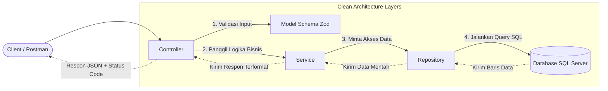

# Penjelasan MVC & Transisi ke Service-Repository Pattern (Clean Architecture)

Dokumen ini menjelaskan konsep dasar **MVC (Model-View-Controller)**, mengapa pola lama satu file (monolitik/tradisional) tidak efisien untuk skala besar, dan mengapa kita melangkah lebih jauh dengan menerapkan **Service-Repository Pattern** (Clean Architecture).

---

## 🍽️ Analogi Evolusi Restoran (Dari 1 File ke Clean Architecture)

Untuk memudahkan pemahaman, mari bandingkan tiga jenis pengelolaan dapur restoran:

### 1. Pola Tradisional 1 File (Single Fighter)
*   **Cara Kerja**: Hanya ada **satu orang** di restoran. Dia yang menerima tamu di meja, mencatat pesanan, pergi ke gudang mengambil bahan, memasak di dapur, menyajikan makanan, hingga mencuci piring.
*   **Masalah**: Jika restoran ramai, orang ini akan kelelahan (kemacetan proses). Jika dia sakit, restoran langsung tutup. Kodenya sangat panjang, berantakan, dan sulit diperbaiki jika ada kesalahan (spaghetti code).

### 2. Pola MVC Tradisional (Pembagian Tugas Dasar)
*   **Cara Kerja**: Tugas mulai dibagi:
    *   **Controller**: Pelayan yang menerima pesanan tamu dan menyajikan makanan.
    *   **Model**: Buku menu dan bahan baku di dalam kulkas.
    *   **View**: Tampilan piring makanan yang disajikan ke pelanggan (dalam API backend, ini berbentuk format data **JSON**).
*   **Masalah**: Di MVC tradisional, Pelayan (Controller) sering kali harus ikut masuk ke gudang untuk mengambil bahan, atau Koki (Model) memiliki query SQL database langsung di dalamnya. Tanggung jawab masih bercampur.

### 3. Pola Service-Repository (Clean Architecture - Yang Kita Gunakan)
*   **Cara Kerja**: Pembagian tugas dilakukan secara mutlak dan profesional:
    *   **Pelayan (Controller)**: Hanya mencatat pesanan tamu, memvalidasi pesanan, dan menyerahkan ke dapur. Dia tidak ikut memasak atau masuk gudang.
    *   **Buku Aturan Pesanan (Model)**: Validasi apakah pesanan masuk akal (misal: jumlah porsi tidak boleh minus).
    *   **Koki/Chef (Service)**: Fokus memasak dan meracik bumbu (Logika Bisnis). Koki tidak tahu cara masuk gudang, dia hanya memesan bahan siap pakai ke petugas gudang.
    *   **Petugas Gudang (Repository)**: Hanya bertugas masuk gudang/kulkas untuk mengambil bahan mentah (Database Query).

---

## 🆚 Tabel Perbandingan Struktur Kode

| Aspek | Pola 1 File (Lama) | MVC Tradisional | Service-Repository (Clean) |
| :--- | :--- | :--- | :--- |
| **Lokasi Routing & HTTP** | Di dalam satu file utama | Controller | Controller |
| **Lokasi Logika Bisnis** | Di dalam satu file utama | Bercampur di Controller/Model | **Service** (Terisolasi) |
| **Lokasi Query SQL** | Di dalam satu file utama | Biasanya di dalam Model/Controller | **Repository** (Terisolasi) |
| **Kemudahan Testing** | Sangat Sulit | Sedang | **Sangat Mudah** (Dapat ditest per baris fungsi) |
| **Dampak Ganti Database** | Harus merombak seluruh file | Merombak file Model & Controller | **Hanya merombak file Repository** |

---

## 🗺️ Bagan Alur Perbandingan Arsitektur

### 1. Pola 1 File (Lama)
```
[Client] ──> [ Satu File Raksasa ] (Menangani: HTTP, Validasi, Logika Bisnis, Query SQL Database)
```

### 2. Pola MVC Tradisional
```
[Client] ──> [ Controller ] ──> [ Model (Berisi Query Database & Validasi) ]
                 │
                 └──> (Mengembalikan View / JSON)
```

### 3. Pola Service-Repository (Clean Architecture)


---

## 💡 Mengapa Kita Mengubah Kode ke Pola Ini?

1.  **Separation of Concerns (Pemisahan Tanggung Jawab)**:
    Setiap file hanya melakukan satu hal dengan baik. 
    *   Ingin mengubah cara validasi input? Ubah di `*.model.js`.
    *   Ada query SQL yang lambat? Perbaiki di `*.repository.js`.
    *   Ingin mengubah diskon harga material? Edit logika di `*.service.js`.
2.  **Keamanan Data**:
    Controller tidak bisa langsung mengakses database tanpa melewati Service. Logika enkripsi password atau validasi kepemilikan data dikunci rapat di tingkat Service.
3.  **Kemudahan Uji Coba (Mocking / Testability)**:
    Jika kita ingin membuat pengujian otomatis (unit test) untuk logika registrasi user, kita tidak perlu menghubungkan aplikasi ke SQL Server sungguhan. Kita cukup membuat *Mock Repository* (Repository tiruan) yang mengembalikan data instan, sehingga pengujian berjalan sangat cepat.
4.  **Siap Menghadapi Perubahan**:
    Jika perusahaan memutuskan migrasi database dari SQL Server ke MySQL atau MongoDB, kita **tidak perlu menyentuh file Controller dan Service sama sekali**. Kita cukup menulis ulang query database di file Repository saja.
