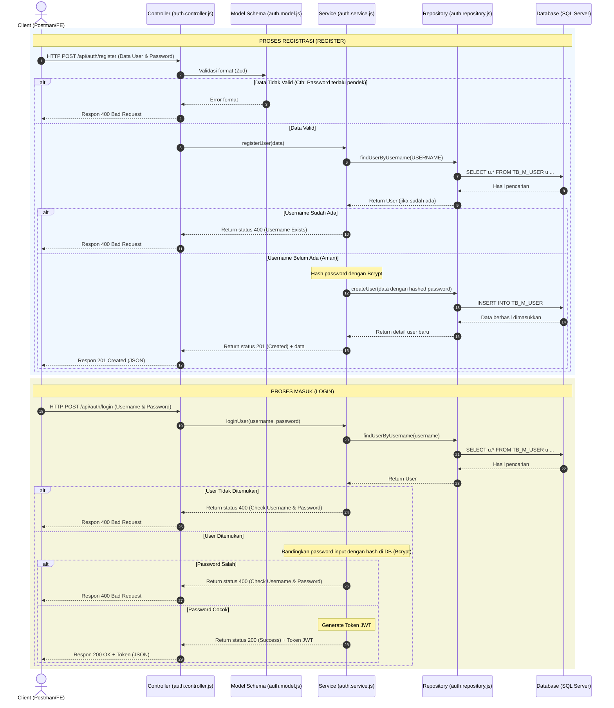

# Clean Architecture in Auth Module

Dokumen ini menjelaskan penerapan **Clean Architecture** pada module **Auth** (Autentikasi & Registrasi) di aplikasi ini. Penjelasan ini dirancang khusus agar mudah dipahami, bahkan bagi Anda yang masih baru (awam) dengan konsep **MVC** dan **Clean Architecture**.

---

## 🔐 Analogi Sederhana: Sistem Gerbang Keamanan Gedung

Bayangkan proses autentikasi (Register & Login) seperti sistem gerbang keamanan masuk ke sebuah **Gedung Perusahaan**:

1.  **Tamu (Client/User)**: Pengguna yang ingin mendaftar (Register), masuk (Login), atau meminta profil mereka (Profile).
2.  **Resepsionis di Lobi (Controller)**: Orang pertama yang ditemui tamu. Resepsionis memeriksa apakah tamu membawa formulir dengan format yang benar (validasi input), menyerahkan formulir tersebut ke bagian verifikasi dalam (Service), dan memberikan kartu akses (Token JWT) jika disetujui.
3.  **Formulir & Kertas Persyaratan (Model)**: Aturan tertulis pengisian formulir. Misal: *"Password harus minimal 6 karakter, memiliki huruf kapital, angka, dan karakter unik"* (Validasi Schema Zod).
4.  **Petugas Verifikasi Internal (Service)**: Orang yang melakukan pengecekan logika. Dia yang memastikan apakah Username sudah terdaftar sebelumnya, mengubah password menjadi kode rahasia (Hashing Password dengan Bcrypt), mencocokkan password saat login, dan membuat kartu pass digital (Token JWT).
5.  **Petugas Buku Arsip Tamu (Repository)**: Orang yang bertugas mencari atau mencatat nama tamu langsung di lemari arsip (Database). Dia hanya bertugas menulis *"Tamu Baru"* ke lemari arsip atau membaca data *"Tamu Lama"*.

---

## 📂 Pembagian Tugas File (Layers)

Dalam folder `src/api/auth/`, terdapat 4 file utama yang mewakili lapisan Clean Architecture:

### 1. `auth.controller.js` (Resepsionis)
*   **Fungsi**: Menerima request HTTP dari client dan mengembalikan response HTTP.
*   **Tugas**:
    *   Menerima request registrasi (`POST /register`), login (`POST /login`), dan profil (`GET /profile`).
    *   Menggunakan middleware `validateInput` untuk menyaring input kotor / tidak valid sebelum diproses.
    *   Memanggil fungsi service seperti `registerUser` atau `loginUser`.
    *   Mengembalikan response HTTP dengan status code yang sesuai (misal: 201 untuk berhasil register, 400 jika input salah, 500 jika error).

### 2. `auth.model.js` (Formulir Validasi)
*   **Fungsi**: Menentukan aturan ketat untuk data input.
*   **Tugas**:
    *   Mendefinisikan skema validasi menggunakan library `zod`.
    *   Menentukan kriteria keamanan password yang kuat (harus mengandung kombinasi huruf besar/kecil, angka, dan karakter khusus).
    *   Memastikan format email yang masuk benar-benar valid.

### 3. `auth.service.js` (Petugas Verifikasi / Logika Bisnis)
*   **Fungsi**: Tempat berkumpulnya seluruh aturan dan logika bisnis autentikasi.
*   **Tugas**:
    *   **Saat Register**: Mengecek apakah username sudah terdaftar. Jika belum, menyandikan password asli menggunakan `bcrypt` (`hashPassword`) demi keamanan sebelum disimpan ke database.
    *   **Saat Login**: Memvalidasi kecocokan username, mencocokkan password terenkripsi (`comparePassword`), dan menerbitkan token akses JWT (`generateToken`).
    *   **Saat Get Profile**: Mengambil detail profil user beserta daftar hak akses menu (`features` dan `functions`) miliknya.

### 4. `auth.repository.js` (Petugas Buku Arsip / Database Access)
*   **Fungsi**: Berinteraksi langsung dengan database SQL Server.
*   **Tugas**:
    *   Jalankan query SQL SELECT untuk mencari user berdasarkan username (`findUserByUsername`).
    *   Jalankan query SQL INSERT untuk menyimpan user baru (`createUser`).
    *   Mengambil hak akses menu user dari tabel `TB_M_ROLE_PERMISSIONS` (`findUserFeatureByUsername` dan `findUserFunctionByUsername`).

---

## 🗺️ Bagan Alur Data (Flow Diagram)

Berikut adalah bagan alur proses **Register** dan **Login**:

---

## 💡 Mengapa Pembagian Ini Sangat Penting di Module Auth?

1.  **Keamanan Berlapis (Security)**:
    Logika enkripsi password (`bcrypt`) dan pembuatan token (`jwt`) sepenuhnya terisolasi di dalam `Service`. Bagian Controller tidak memiliki akses langsung untuk mengubah password tanpa di-hash terlebih dahulu.
2.  **Skalabilitas Login**:
    Jika suatu saat kita ingin mengganti metode enkripsi password (misal dari Bcrypt ke Argon2) atau mengubah sistem token (misal menggunakan OAuth / Firebase Auth), kita **hanya perlu mengubah di tingkat `Service`**, tanpa merusak routing di `Controller` atau query di `Repository`.
3.  **Kemudahan Unit Test**:
    Kita dapat membuat pengujian otomatis (Unit Testing) untuk memastikan proses hashing password dan pembuatan token berjalan dengan benar tanpa perlu melakukan koneksi ke database SQL Server sungguhan.