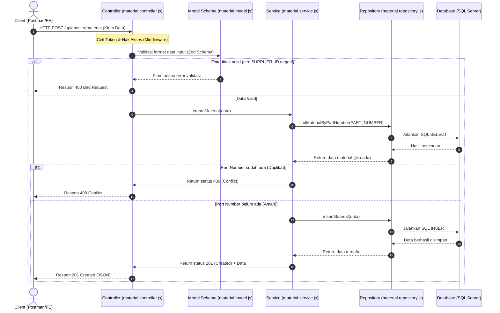

# Clean Architecture in Master Material

Dokumen ini menjelaskan penerapan **Clean Architecture** pada module **Master Material** di aplikasi ini. Penjelasan ini dirancang khusus agar mudah dipahami, bahkan bagi Anda yang masih baru (awam) dengan konsep **MVC (Model-View-Controller)** dan **Clean Architecture**.

---

## 🥪 Analogi Sederhana: Sistem Restoran

Bayangkan module Master Material ini seperti sebuah **Restoran**:

1. **Pelanggan (Client/User)**: Orang yang memesan makanan (mengirim permintaan/HTTP request lewat Postman atau Browser).
2. **Pelayan / Pramusaji (Controller)**: Orang pertama yang menemui pelanggan. Tugasnya mencatat pesanan, memastikan pelanggan berhak memesan (authorization), mengecek format pesanan (validation), menyampaikannya ke Koki (Service), dan menyajikan makanan ke pelanggan setelah siap (HTTP response).
3. **Buku Menu / Aturan Pemesanan (Model)**: Daftar aturan pemesanan yang valid. Misal: *"Pesanan porsi harus berupa angka positif"* atau *"Nama makanan tidak boleh kosong"*.
4. **Koki / Chef (Service)**: Orang di dapur yang bertugas memasak. Dia yang tahu cara memproses bahan makanan, meracik bumbu, dan menentukan logika masakan (Business Logic). Koki tidak tahu cara mengambil bahan langsung dari pasar/gudang penyimpanan, dia hanya menerima bahan mentah dari petugas gudang.
5. **Petugas Gudang (Repository)**: Orang yang bertugas mengambil bahan mentah dari tempat penyimpanan/kulkas/database. Koki tidak peduli kulkasnya merk apa atau bagaimana cara menyusun bahan di dalam gudang, koki hanya tinggal meminta *"Tolong ambilkan daging sapi"* ke Petugas Gudang.
6. **Kulkas / Lemari Bahan (Database)**: Tempat penyimpanan data mentah yang aman.

---

## 📂 Pembagian Tugas File (Layers)

Dalam folder `src/api/master/material/`, terdapat 4 file utama yang mewakili lapisan Clean Architecture:

### 1. `material.controller.js` (Pelayan)
*   **Fungsi**: Sebagai gerbang masuk (Entry Point) permintaan dari luar.
*   **Tugas**:
    *   Menerima HTTP Request (GET, POST, PUT, DELETE).
    *   Memasang pengaman seperti `authorize` (mengecek token login) dan `featureGuard` (mengecek hak akses menu).
    *   Melakukan validasi awal menggunakan schema Zod dari Model.
    *   Memanggil fungsi di `Service` untuk memproses data.
    *   Mengembalikan HTTP Response (Status Code & data JSON) ke client.
*   **Aturan**: *Tidak boleh menulis query database (SQL) langsung di sini.*

### 2. `material.model.js` (Buku Menu)
*   **Fungsi**: Mendefinisikan struktur data dan aturan validasi.
*   **Tugas**:
    *   Menggunakan library `zod` untuk membuat skema validasi.
    *   Menentukan tipe data, panjang karakter, atau batasan nilai untuk field seperti `PART_NUMBER`, `NAME`, `CATEGORY`, `UNIT`, dan `SUPPLIER_ID`.
*   **Aturan**: *Hanya fokus pada bentuk data dan validasinya.*

### 3. `material.service.js` (Koki)
*   **Fungsi**: Pusat logika bisnis (Business Logic / Use Case).
*   **Tugas**:
    *   Mengolah logika aplikasi secara detail.
    *   Contoh Logika Bisnis: Sebelum membuat data baru, service akan mengecek dulu apakah `PART_NUMBER` tersebut sudah terdaftar di database. Jika sudah ada, service menolak proses dan mengembalikan kode status 409 (Conflict). Jika belum ada, service memanggil Repository untuk memasukkannya ke database.
    *   Membungkus hasil proses menjadi format response yang konsisten (menentukan HTTP status code dan format pesan sukses/gagal).
*   **Aturan**: *Tidak peduli bagaimana data diambil dari database (SQL). Service hanya tahu memanggil fungsi Repository dan menerima hasilnya.*

### 4. `material.repository.js` (Petugas Gudang)
*   **Fungsi**: Melakukan operasi langsung ke database (Data Access).
*   **Tugas**:
    *   Menghubungkan aplikasi ke database menggunakan query SQL murni.
    *   Berisi fungsi-fungsi CRUD dasar: `findAllMaterial`, `findMaterialById`, `insertMaterial`, `updateMaterialById`, dan `deleteMaterialById`.
*   **Aturan**: *Tidak boleh berisi logika bisnis (misalnya validasi duplikasi data). Repository hanya bertugas mengambil atau menyimpan data sesuai perintah dari Service.*

---

## 🗺️ Bagan Alur Data (Flow Diagram)

Berikut adalah bagan alur komunikasi antar file dari saat client mengirim permintaan hingga menerima balasan:

---

## 💡 Mengapa Kita Menggunakan Pola Ini? (Keuntungan Clean Architecture)

Jika Anda terbiasa dengan MVC tradisional di mana Controller langsung mengakses Database, pola Clean Architecture ini mungkin terlihat membuat file jadi lebih banyak. Namun, ada alasan kuat di baliknya:

1.  **Kemudahan Pengujian (Testability)**:
    Kita bisa dengan mudah menguji Koki (`Service`) tanpa perlu menyalakan database sungguhan. Kita bisa membuat "Petugas Gudang bohongan" (Mock Repository) untuk menguji apakah koki dapat memasak dengan benar.
2.  **Kemudahan Maintenance & Skala Besar**:
    Jika nanti database kita ganti (misal dari SQL Server ke MongoDB), kita **hanya perlu mengubah file `material.repository.js`** saja. Logika bisnis di `material.service.js` dan endpoint di `material.controller.js` tidak perlu diubah sama sekali!
3.  **Pemisahan Tanggung Jawab (Separation of Concerns)**:
    Setiap file memiliki satu tanggung jawab fokus. Jika ada error pada query SQL, kita tahu pasti harus mencari di `material.repository.js`. Jika ada kesalahan logika bisnis, kita langsung menuju `material.service.js`.
