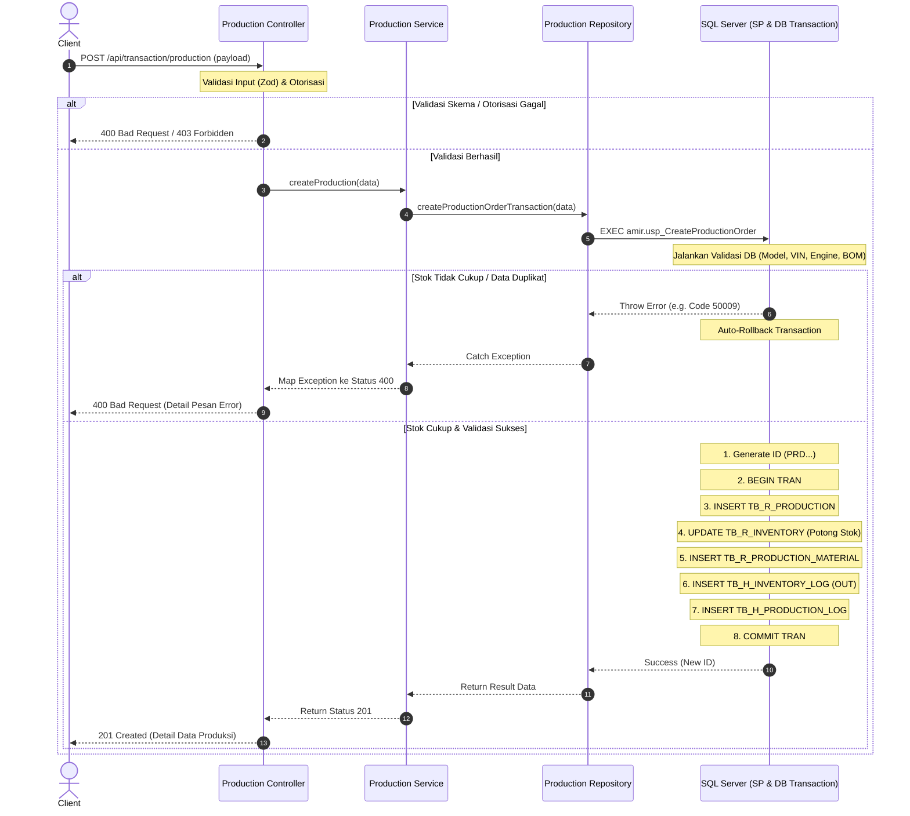
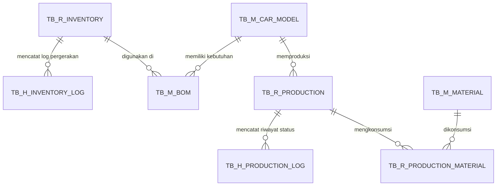

# Dokumentasi Sistem Transaksi Produksi (`TB_R_PRODUCTION`)

Dokumen ini menjelaskan alur kerja (workflow), arsitektur, dan database schema dari transaksi pembuatan perintah produksi mobil. Transaksi ini mengintegrasikan pengecekan Bill of Materials (BOM), pengurangan stok bahan baku secara otomatis di inventory, serta pencatatan audit logs untuk melacak pergerakan barang dan status produksi.

---

## 1. Alur Transaksi Pembuatan Produksi

Saat client memicu request untuk memulai proses produksi mobil:
1. **Validasi Input**: Validasi kebenaran skema payload (Car Model ID, VIN, dan nomor mesin unik) menggunakan Zod schema.
2. **Pengecekan Otorisasi**: Middleware memeriksa hak akses user (`featureGuard` dan `functionGuard`).
3. **Validasi Master & BOM**: Stored procedure di database memastikan data Car Model ada dan memiliki definisi BOM yang terdaftar.
4. **Validasi Ketersediaan Stok**: Membandingkan kebutuhan kuantitas bahan baku pada BOM dengan stok aktual di inventory (`TB_R_INVENTORY`). Jika stok ada yang tidak cukup, transaksi langsung dibatalkan (rollback).
5. **Eksekusi Transaksi database (ACID)**:
   - Membuat ID unik dengan format `PRD[YYYYMM][SEQUENCE]` menggunakan stored procedure `usp_GenerateBusinessKey`.
   - Mengurangi stok bahan baku di `TB_R_INVENTORY`.
   - Menyimpan daftar material yang dikonsumsi ke `TB_R_PRODUCTION_MATERIAL`.
   - Mencatat log pergerakan stok sebagai `'OUT'` di `TB_H_INVENTORY_LOG` untuk audit.
   - Mencatat log status produksi menjadi `'In Progress'` di `TB_H_PRODUCTION_LOG`.

---

## 2. Diagram Alur Transaksi (Mermaid)

Berikut adalah diagram sekuensial yang menggambarkan proses pembuatan perintah produksi:

---

## 3. Struktur Tabel yang Terlibat

Sistem transaksi ini berinteraksi langsung dengan tabel-tabel berikut:

1. **TB_M_CAR_MODEL**: Referensi tipe mobil yang diproduksi.
2. **TB_M_BOM**: Menyimpan formula kebutuhan material (kombinasi model mobil dan item inventory).
3. **TB_R_INVENTORY**: Mengurangi nilai `QUANTITY` stok ketika produksi dimulai.
4. **TB_R_PRODUCTION**: Menyimpan header transaksi produksi (status, nomor order, VIN, nomor mesin).
5. **TB_R_PRODUCTION_MATERIAL**: Menyimpan detail bahan baku yang dikonsumsi per perintah produksi.
6. **TB_H_INVENTORY_LOG**: Mencatat history pengeluaran material (`OUT`) beserta sisa saldo stok (`BALANCE`).
7. **TB_H_PRODUCTION_LOG**: Melacak perubahan status produksi (misal: NULL -> `In Progress` -> `Completed`).
